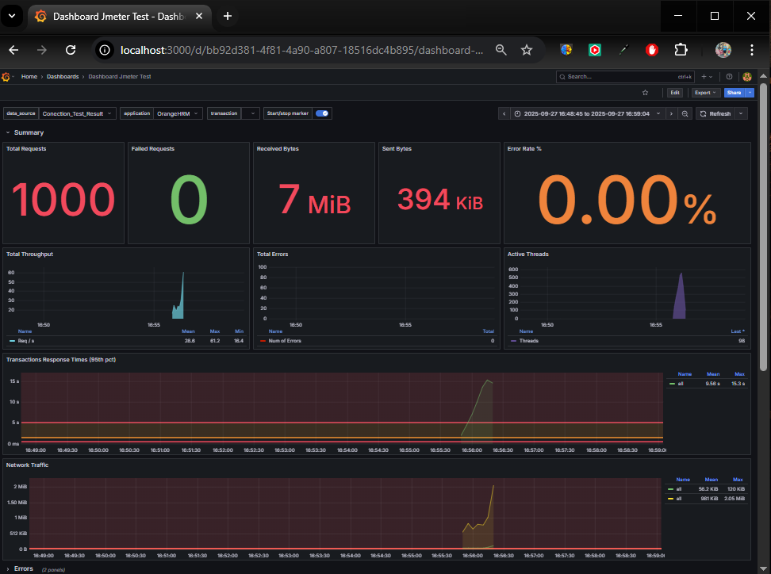

# Integração Cypress + JMeter + InfluxDB + Grafana

Este guia descreve o passo a passo para integrar testes funcionais e de performance usando **Cypress**, **JMeter**, **InfluxDB** e **Grafana**.  
O objetivo é automatizar o fluxo de **login via Cypress**, reutilizar o **cookie** no **JMeter**, e enviar métricas para monitoramento no **Grafana**.

---

## **1. Estrutura de Projeto**

```
project-root/
├── cypress/
│   ├── e2e/
│   │   └── login.cy.js        # Script de login Cypress
│   └── fixtures/
│       └── session.json       # Cookie salvo
├── jmeter/
│   └── test-plan.jmx          # Plano de teste JMeter
└── README.md
```

---

## **2. Cypress - Capturando o Cookie**

O Cypress será usado para **automatizar o login** e capturar **dados dinâmicos** como cookie.

> **URL principal:** [https://opensource-demo.orangehrmlive.com/](https://opensource-demo.orangehrmlive.com/)

### **2.1. Login e Captura do Cookie (UI)**

Arquivo em: `cypress/e2e/login.cy.js`

```javascript
describe("Login via UI", () => {
  it("Logs", () => {
    cy.visit("https://opensource-demo.orangehrmlive.com/");
    ...
  });
});
```

### **2.2. Executando Cypress**

```bash
npx cypress run --spec "cypress/e2e/login.cy.js"
```

Após a execução, será gerado o arquivo:

```json
cypress/fixtures/session.json

{
  "cookie": "valor_do_cookie_aqui"
}
```

---

## **3. JMeter - Consome o Cookie e Executa Testes**

### **3.1 Executando JMeter**

Command prompt (cmd) - Ajuste conforme o caminho do arquivo

```
cd C:\jmeter\apache-jmeter-5.6.3\bin
jmeter.bat
```

### **3.2 Cofigure o "Authenticated Request"**

```bash
Protocol [https]:https
Server Name or IP: EX: (opensource-demo.orangehrmlive.com)
HTTP Request: GET
Path:/web/index.php/dashboard/index
```

### **3.3 Carregar o Cookie via JSR223 PreProcessor**

No **Thread Group**, adicione:  
`Add → Pre Processors → JSR223 PreProcessor`

Script **Groovy**:

```groovy
import groovy.json.JsonSlurper
def cookieFile = new File("cypress/fixtures/session.json")
def json = new JsonSlurper().parseText(cookieFile.text)
vars.put("session_cookie", json.cookie)
```

### **3.4. HTTP Header Manager**

Adicione em:  
`Add → Config Element → HTTP Header Manager`

| Name   | Value                       |
| ------ | --------------------------- |
| Cookie | orangehrm=${session_cookie} |

> **Atenção:** `orangehrm` é o nome do cookie no OrangeHRM. Ajuste se o nome for diferente.

### **3.5. HTTP Request**

- **Protocol:** `https`
- **Server Name:** `opensource-demo.orangehrmlive.com`
- **Path:** `/web/index.php/dashboard/index`
- **Method:** `GET`

### **3.6. Backend Listener (InfluxDB)**

Adicione em:  
`Add → Listener → Backend Listener`

| Field                 | Value                                                                          |
| --------------------- | ------------------------------------------------------------------------------ |
| Implementation        | `org.apache.jmeter.visualizers.backend.influxdb.InfluxdbBackendListenerClient` |
| influxdbMetricsSender | `org.apache.jmeter.visualizers.backend.influxdb.HttpMetricsSender`             |
| influxdbUrl           | `http://localhost:8086/write?db=jmeter`                                        |
| application           | `orangehrm-tests`                                                              |
| measurement           | `jmeter`                                                                       |
| summaryOnly           | `false`                                                                        |

---

## **4 Configurando o InfluxDB**

O InfluxDB será usado para armazenar as métricas do JMeter.

### **4.1. Instalação (Windows via PowerShell)**

powershell

```
wget https://download.influxdata.com/influxdb/releases/influxdb-1.12.2-windows.zip -UseBasicParsing -OutFile influxdb-1.12.2-windows.zip
Expand-Archive .\influxdb-1.12.2-windows.zip -DestinationPath 'C:\Program Files\InfluxData'
```

### **4.2. Iniciando o InfluxDB**

Powershell (Ajuste o caminho do seu arquivo)

```
cd "C:\Program Files\InfluxData\influxdb"
.\influxd.exe
```

Abra outro terminal e conecte-se ao CLI:

```powershell
cd "C:\Program Files\InfluxData\influxdb"
.\influx.exe
```

Saída esperada:

```
Connected to http://localhost:8086 version 1.12.2
InfluxDB shell version: 1.12.2
```

### **4.3 Criando Banco e Usuário**

```sql
> CREATE DATABASE jmeter
> CREATE USER jmeter_test WITH PASSWORD 'test123'
> SHOW DATABASES
> SHOW USERS
```

---

## **5. Configurando o Grafana**

---

### **5.1. Executando Grafana no Windows**

Abra outro terminal Powershell (Ajuste sempre o caminho do seu arquivo)

```powershell
cd "C:\grafana-enterprise_12.2.0_17949786146_windows_amd64\grafana-12.2.0\bin"
dir
.\grafana-server.exe
```

Acesse no navegador:  
[http://localhost:3000](http://localhost:3000)

### **5.2. Conectar Grafana ao InfluxDB**

- **Settings → Data Sources → Add Data Source → InfluxDB**
- Configure:

| Campo          | Valor                   |
| -------------- | ----------------------- |
| URL            | `http://localhost:8086` |
| Database       | `jmeter`                |
| User/Pass      | `jmeter_test / test123` |
| Query Language | `InfluxQL`              |

### **5.3. Importar Dashboard Pronto**

- Acesse: [Dashboard 5496 - JMeter](https://grafana.com/grafana/dashboards/5496-apache-jmeter-dashboard-by-ubikloadpack/)
- Importe o JSON no Grafana.

### **5.4. Métricas Recomendadas**

- **Tempo de Resposta por Endpoint**
- **Throughput (RPS)**
- **Erros por Thread**
- **Percentil de Latência**
- **Status HTTP**

---

## **6. Fluxo Completo de Execução**

1. Iniciar **InfluxDB**:

   ```powershell
   cd "C:\Program Files\InfluxData\influxdb"
   .\influxd.exe
   ```

2. Iniciar **Grafana**:

   ```powershell
   cd "C:\grafana-enterprise_12.2.0_17949786146_windows_amd64\grafana-12.2.0\bin"
   dir
   .\grafana-server.exe
   ```

3. Rodar Test no Jmeter

   ```bash
   start >
   ```

4. Visualizar métricas no Grafana:  
   [http://localhost:3000](http://localhost:3000)



---

## **7. Checklist Final**

| Etapa                                     | Status |
| ----------------------------------------- | ------ |
| Cypress captura cookie de login           | ✅     |
| Cookie é carregado pelo JMeter via JSR223 | ✅     |
| HTTP Request autenticado responde 200 OK  | ✅     |
| Métricas enviadas ao InfluxDB             | ✅     |
| Grafana exibe dashboards em tempo real    | ✅     |

---

## **8. Referências**

- [Cypress](https://www.cypress.io/)
- [Apache JMeter](https://jmeter.apache.org/)
- [InfluxDB](https://www.influxdata.com/)
- [Grafana](https://grafana.com/)

## **9. LICENSE - MIT**
